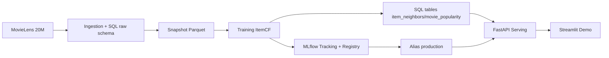
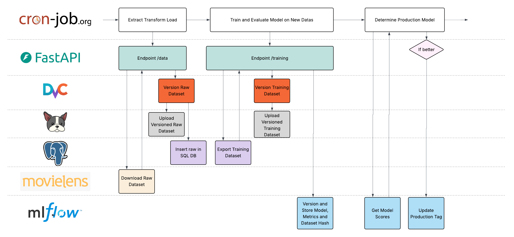

# Reco Films MLOps

<div align="center">

[](#)
[](#)
[](#)
[](#)
[](#)
[](#)
[](#)

</div>

> Systeme de recommandation de films industrialise MLOps: ingestion MovieLens 20M, entrainement item-based CF, tracking MLflow, versioning DVC, serving FastAPI, interface Streamlit.

---

## Vue d'ensemble

Ce repository contient une plateforme de recommandation orientee production avec une architecture microservices.

- Dataset: MovieLens 20M (ratings, movies, tags, etc.)
- Modele: Item-Based Collaborative Filtering (`kNN cosine` sur matrice sparse)
- Serving: API FastAPI + frontend Streamlit
- MLOps: MLflow (experiences + registry), DVC (versioning data), instrumentation Prometheus pour le monitoring API
- Objectif metier cle: gerer le cold-start avec fallback de popularite bayesienne

---

## Architecture

### Services Docker

| Service | Role | Port |
|---|---|---|
| `postgres` | Base applicative (`raw.*` tables, `current_*` views) | `5432` |
| `mlflow-db` | Base PostgreSQL du tracking MLflow | interne |
| `mlflow` | Tracking server + model registry | `5000` |
| `api` | FastAPI (recommandation, pipeline triggers, observabilite) | `8000` |
| `frontend` | App Streamlit (slides + demo live) | `8501` |

### Flux end-to-end



### Automatisation



---

## Pipelines

### 1) Pipeline ingestion data

- Telechargement MovieLens (`src/ingestion/ingestion_movielens.py`)
- Initialisation DB + schema `raw` (`src/ingestion/init_db.py`)
- Chargement SQL par chunks des CSV
- Versioning DVC des donnees brutes (`data/raw.dvc`)

### 2) Pipeline entrainement modele

- Creation du snapshot `data/training_set.parquet` (`src/ingestion/create_snapshot.py`)
- Entrainement item-item kNN (`src/models/train_model2.py`)
- Evaluation ranking (`recall@10`, `ndcg@10`)
- Log des artefacts (`item_neighbors.parquet`, `movie_popularity.parquet`)
- Enregistrement dans MLflow Registry (`reco-films-itemcf-v2`)
- Promotion de la meilleure version (`src/models/promote_best_model.py`)

### 3) Pipeline serving online

- Chargement du modele `models:/reco-films-itemcf-v2@production`
- Warm-up cache modele au demarrage API
- Recommandations personnalisees via `/recommend`
- Endpoints fallback/diagnostic (`/movies/popular`, `/ready`, `/model/*`)

---

## Strategie cold-start

Deux fallbacks concrets sont implementes:

- Nouveaux utilisateurs: fallback sur les films populaires via score bayesien (`raw.movie_popularity`)
- Nouveaux films: filtrage par seuil minimum de ratings avant entree dans le graphe de voisins

Cette strategie garde des recommandations robustes meme avec peu ou pas d'historique utilisateur.

---

## Pratiques MLOps implementees

- Architecture microservices avec Docker Compose
- Versioning donnees avec DVC
- Tracabilite modele avec MLflow (params, metrics, artefacts, aliases)
- Checks de qualite SQL (`src/ingestion/check_db.py`)
- Reproductibilite via scripts pipeline
- Observabilite API via `prometheus-fastapi-instrumentator`
- Documentation/demo Streamlit pour la communication projet

---

## Quickstart

### Prerequis

- Docker + Docker Compose
- Optionnel hors Docker: Python 3.10

### Lancer la stack

```bash
docker compose up --build
```
### Pipeline Data (Via API)


### Pipeline Training (Via API)


### Détermination du Modèle de Prod

A lancer à la racine du projet:  
````
python -m src.models.promote_best_model
````

## Automatisation

### Pré-requis  
* Git, DVC, Python installés.
* Accès au dépôt Git
* Crédential pour le DVC

### Configuration du dvc  
````
dvc remote modify --local origin url 'https://dagshub.com/pierreB-boop/sep25_bmle_mlops_reco_films.dvc'  
dvc remote modify --local origin auth basic  
dvc remote modify --local origin user 'votre_username_dagshub'  
dvc remote modify --local origin password 'votre_token_dagshub'  
````

### Lancement du Pipeline complet   
````
chmod +x daily_pipeline.sh  
bash daily_pipeline.sh
````

### Automatisation via cronjobs  
````
crontab -e
0 2 * * * /bin/bash /home/user/sep25_bmle_mlops_reco_films/daily_pipeline.sh #A remplacer par votre chemin absolu
````

## Points d'acces

- Frontend Streamlit: `http://localhost:8501`
- FastAPI: `http://localhost:8000`
- Docs API: `http://localhost:8000/docs`
- MLflow UI: `http://localhost:5000`

---

## Endpoints API principaux

### Sante systeme

- `GET /health`: statut simple
- `GET /ready`: readiness DB + modele

### Recommandation et catalogue

- `GET /recommend?user_id=1&top_n=5`
- `GET /movies/popular?limit=10`
- `GET /movies/{movie_id}`

### Observabilite modele

- `GET /model/metadata`
- `GET /model/config`

### Triggers pipeline

- `POST /data`: ingestion + reload cache
- `POST /training`: snapshot + training + update modele

---

## Structure du projet

```text
.
|-- docker-compose.yml
|-- main_user_api.py
|-- daily_pipeline.sh
|-- data/
|-- mlartifacts/
|-- reports/figures/
`-- src/
    |-- ingestion/
    |-- models/
    |-- streamlit/
    `-- visualization/
```

---

## Execution manuelle (hors Docker)

```bash
# 1) Ingestion
python -m src.ingestion.ingestion_movielens

# 2) Snapshot
python src/ingestion/create_snapshot.py

# 3) Training
python -m src.models.train_model2 --n-neighbors 20 --min-ratings 50

# 4) Promotion
python -m src.models.promote_best_model

# 5) API
uvicorn main_user_api:app --host 0.0.0.0 --port 8000

# 6) Frontend
streamlit run src/streamlit/project_prez.py
```

---

## Notes

- `daily_pipeline.sh` orchestre Git + DVC + ingestion + training + promotion.
- Les artefacts MLflow sont persistants dans `./mlartifacts`.
- Le serving online evite la reinference lourde en temps reel grace a des artefacts precalcules.

---

## Equipe

- Pierre Barbetti
- Raphael Da Silva
- Martine Mateus
- Laurent Piacentile
